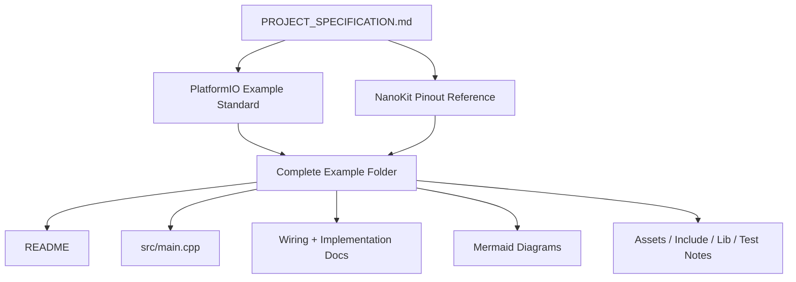

# NanoKit-ESP32

**Developed by Amine Saoud ibn al-Bashir.**

NanoKit Integrated ESP32 Dev Board is an open-source embedded development platform for IoT, AI, robotics, education, and professional prototyping. This repository is organized for PlatformIO examples, complete applications, community projects, graduation projects, simulation resources, documentation, articles, tutorials, and reusable templates.

The NanoKit board is part of the wider UMT hardware vision, but this repository's firmware examples use standard PlatformIO Arduino C++ and ESP32 GPIO numbers so they can compile and run directly in PlatformIO.

## Repository Mission

This is not a demo repository and not a template repository. It is the official long-term NanoKit-ESP32 ecosystem repository for educational and professional embedded systems development.

See [PROJECT_SPECIFICATION.md](PROJECT_SPECIFICATION.md) for the master repository rules, growth model, example standards, documentation requirements, and Definition of Done.

## Generated Indexes

- [Repository Index](REPOSITORY_INDEX.md) summarizes the main repository areas.
- [Repository Tree](REPOSITORY_TREE.md) shows the generated file tree.

Run `python tools/update_repository_index.py` after adding examples, applications, open-source projects, tutorials, articles, docs, assets, or templates. On this local checkout, the pre-commit hook also refreshes the generated index files automatically before commits.

## Interactive Repository Tree

The tree below is generated from the current repository contents. Select its title to expand or collapse it. The local pre-commit hook and the GitHub workflow refresh it automatically when projects or files are added, moved, or removed.

<details>
<summary><strong>Open current NanoKit-ESP32 tree</strong></summary>

<!-- GENERATED_REPOSITORY_TREE:START -->
```text
NanoKit-ESP32/
|-- .githooks/
|   `-- pre-commit
|-- .github/
|   `-- workflows/
|       `-- repository-index.yml
|-- applications_on_platformio/
|   |-- face_rotation_tracking_camera/
|   |   |-- .genius/
|   |   |   `-- README.md
|   |   |-- assets/
|   |   |   `-- README.md
|   |   |-- docs/
|   |   |   `-- README.md
|   |   |-- esp32/
|   |   |   |-- docs/
|   |   |   |   |-- Implementation_Guide.md
|   |   |   |   `-- Wiring.md
|   |   |   |-- include/
|   |   |   |   `-- README.md
|   |   |   |-- lib/
|   |   |   |   `-- README.md
|   |   |   |-- src/
|   |   |   |   `-- main.cpp
|   |   |   |-- test/
|   |   |   |   `-- README.md
|   |   |   `-- platformio.ini
|   |   |-- images/
|   |   |   `-- connection-diagram.md
|   |   |-- vision/
|   |   |   `-- README.md
|   |   `-- README.md
|   |-- industrial_monitoring/
|   |   `-- README.md
|   |-- smart_home_controller/
|   |   `-- README.md
|   |-- weather_station/
|   |   `-- README.md
|   `-- README.md
|-- articles/
|   |-- ai/
|   |   `-- README.md
|   |-- embedded_systems/
|   |   `-- README.md
|   |-- iot/
|   |   `-- README.md
|   |-- nanokit/
|   |   `-- README.md
|   |-- platformio/
|   |   `-- README.md
|   |-- robotics/
|   |   `-- README.md
|   |-- umt_platform/
|   |   `-- README.md
|   `-- README.md
|-- assets/
|   |-- banners/
|   |   `-- .gitkeep
|   |-- icons/
|   |   `-- .gitkeep
|   |-- images/
|   |   `-- .gitkeep
|   |-- logos/
|   |   `-- .gitkeep
|   |-- videos/
|   |   `-- .gitkeep
|   `-- README.md
|-- docs/
|   |-- api/
|   |   `-- README.md
|   |-- architecture/
|   |   `-- README.md
|   |-- getting_started/
|   |   `-- README.md
|   |-- hardware/
|   |   |-- nanokit-integrated-esp32-pinout.md
|   |   `-- README.md
|   |-- installation/
|   |   `-- README.md
|   |-- roadmap/
|   |   `-- README.md
|   |-- software/
|   |   |-- platformio-example-standard.md
|   |   `-- README.md
|   |-- troubleshooting/
|   |   `-- README.md
|   `-- README.md
|-- examples_on_platformio/
|   |-- camera_tracking/
|   |   |-- .genius/
|   |   |   `-- README.md
|   |   |-- assets/
|   |   |   `-- README.md
|   |   |-- docs/
|   |   |   |-- Implementation_Guide.md
|   |   |   `-- Wiring.md
|   |   |-- images/
|   |   |   `-- connection-diagram.md
|   |   |-- include/
|   |   |   `-- README.md
|   |   |-- lib/
|   |   |   `-- README.md
|   |   |-- src/
|   |   |   `-- main.cpp
|   |   |-- test/
|   |   |   `-- README.md
|   |   |-- platformio.ini
|   |   `-- README.md
|   |-- stepper_motor_control/
|   |   |-- .genius/
|   |   |   `-- README.md
|   |   |-- assets/
|   |   |   `-- README.md
|   |   |-- docs/
|   |   |   |-- Implementation_Guide.md
|   |   |   `-- Wiring.md
|   |   |-- images/
|   |   |   `-- connection-diagram.md
|   |   |-- include/
|   |   |   `-- README.md
|   |   |-- lib/
|   |   |   `-- README.md
|   |   |-- src/
|   |   |   `-- main.cpp
|   |   |-- test/
|   |   |   `-- README.md
|   |   |-- platformio.ini
|   |   `-- README.md
|   |-- ultrasonic_distance/
|   |   |-- .genius/
|   |   |   `-- README.md
|   |   |-- assets/
|   |   |   `-- README.md
|   |   |-- docs/
|   |   |   |-- Implementation_Guide.md
|   |   |   `-- Wiring.md
|   |   |-- images/
|   |   |   `-- connection-diagram.md
|   |   |-- include/
|   |   |   `-- README.md
|   |   |-- lib/
|   |   |   `-- README.md
|   |   |-- src/
|   |   |   `-- main.cpp
|   |   |-- test/
|   |   |   `-- README.md
|   |   |-- platformio.ini
|   |   `-- README.md
|   `-- README.md
|-- graduation_projects/
|   |-- bachelor_projects/
|   |   `-- README.md
|   |-- capstone_projects/
|   |   `-- README.md
|   |-- engineering_projects/
|   |   `-- README.md
|   |-- institute_projects/
|   |   `-- README.md
|   |-- master_projects/
|   |   `-- README.md
|   |-- templates/
|   |   `-- README.md
|   |-- university_thesis/
|   |   `-- README.md
|   `-- README.md
|-- open_source_projects/
|   |-- community_projects/
|   |   `-- README.md
|   |-- contributor_projects/
|   |   `-- README.md
|   |-- hackathon_projects/
|   |   `-- README.md
|   |-- nanokit_drone_4x_quadcopter/
|   |   |-- assets/
|   |   |   `-- README.md
|   |   |-- camera_node/
|   |   |   `-- README.md
|   |   |-- docs/
|   |   |   |-- Architecture.md
|   |   |   |-- Bill_of_Materials.md
|   |   |   |-- Bluetooth_Protocol.md
|   |   |   |-- Calibration.md
|   |   |   |-- Camera_Integration.md
|   |   |   |-- Open_Source_References.md
|   |   |   |-- PID_Tuning.md
|   |   |   |-- Safety.md
|   |   |   |-- Testing.md
|   |   |   `-- Wiring.md
|   |   |-- firmware/
|   |   |   |-- .vscode/
|   |   |   |   |-- c_cpp_properties.json
|   |   |   |   |-- extensions.json
|   |   |   |   `-- launch.json
|   |   |   |-- include/
|   |   |   |   `-- README.md
|   |   |   |-- lib/
|   |   |   |   `-- README.md
|   |   |   |-- src/
|   |   |   |   `-- main.cpp
|   |   |   |-- test/
|   |   |   |   `-- README.md
|   |   |   |-- .gitignore
|   |   |   `-- platformio.ini
|   |   |-- images/
|   |   |   |-- camera-wiring.md
|   |   |   |-- connection-diagram.md
|   |   |   |-- control-loop.md
|   |   |   |-- motor-layout.md
|   |   |   `-- system-diagram.md
|   |   |-- web_controller/
|   |   |   |-- app.js
|   |   |   |-- index.html
|   |   |   |-- manifest.json
|   |   |   |-- README.md
|   |   |   `-- styles.css
|   |   |-- project.yml
|   |   `-- README.md
|   |-- showcase_projects/
|   |   `-- README.md
|   |-- templates/
|   |   `-- README.md
|   `-- README.md
|-- simulator/
|   |-- assets/
|   |   `-- .gitkeep
|   |-- engine/
|   |   `-- README.md
|   |-- examples/
|   |   `-- README.md
|   |-- web/
|   |   `-- README.md
|   `-- README.md
|-- templates/
|   |-- application_template/
|   |   `-- README.md
|   |-- documentation_template/
|   |   `-- README.md
|   |-- example_template/
|   |   `-- README.md
|   |-- thesis_template/
|   |   `-- README.md
|   `-- README.md
|-- tools/
|   |-- sync_with_github.ps1
|   `-- update_repository_index.py
|-- tutorials/
|   |-- advanced/
|   |   `-- README.md
|   |-- beginner/
|   |   `-- README.md
|   |-- intermediate/
|   |   `-- README.md
|   |-- projects/
|   |   `-- README.md
|   |-- video_links/
|   |   `-- README.md
|   `-- README.md
|-- .gitignore
|-- CHANGELOG.md
|-- CONTRIBUTING.md
|-- DEVELOPMENT_CREDIT.md
|-- LICENSE
|-- PROJECT_SPECIFICATION.md
|-- README.md
|-- REPOSITORY_INDEX.md
`-- REPOSITORY_TREE.md
```
<!-- GENERATED_REPOSITORY_TREE:END -->

</details>

## How the Repository Is Built



## Featured Open-Source Project

[NanoKit Drone 4X (Quadcopter)](open_source_projects/nanokit_drone_4x_quadcopter/README.md) is the repository's four-brushless-motor NanoKit flight-control reference. It includes PlatformIO firmware, a BLE browser controller, Quad-X motor mixing, MPU6050 calibration, PID tuning, component selection, wiring diagrams, and safety-first bench-test documentation.

## Quality Contract

Official content in this repository should be production-ready, educational, complete, and maintainable.

- Do not leave directories empty as final work.
- Do not add placeholder content when real educational material can be provided.
- Build on existing work instead of overwriting it unnecessarily.
- Every example should teach the code, wiring, algorithm, pin mapping, and troubleshooting path.
- Every hardware example must document NanoKit pin numbers and ESP32 GPIO numbers.

Use [docs/software/platformio-example-standard.md](docs/software/platformio-example-standard.md) when creating or reviewing examples.

## Repository Layout

| Path | Purpose |
|---|---|
| `examples_on_platformio/` | Focused PlatformIO examples for individual sensors, actuators, and board features. |
| `applications_on_platformio/` | Complete multi-part applications with ESP32 firmware, docs, assets, and generated guide folders. |
| `open_source_projects/` | Community, contributor, showcase, hackathon, and reusable open-source project areas. |
| `graduation_projects/` | Bachelor, master, engineering, thesis, institute, and capstone project workspaces. |
| `simulator/` | Web simulator, simulation engine, examples, and simulator assets. |
| `docs/` | Getting started, installation, hardware, software, API, troubleshooting, roadmap, and architecture docs. |
| `articles/` | Technical articles for embedded systems, IoT, AI, robotics, PlatformIO, NanoKit, and related ecosystem topics. |
| `tutorials/` | Beginner through advanced tutorials, project guides, and video link indexes. |
| `templates/` | Reusable templates for examples, applications, thesis work, and documentation. |
| `assets/` | Shared images, icons, logos, banners, and videos. |

## PlatformIO Baseline

PlatformIO projects use the ESP32 Arduino framework as the first public baseline:

```ini
[env:nanokit_esp32]
platform = espressif32
board = esp32dev
framework = arduino
monitor_speed = 115200
upload_speed = 921600
```

Dedicated NanoKit board definitions can replace the generic `esp32dev` board profile as the hardware package evolves.

## Firmware Rule

Official examples in this repository must use:

- PlatformIO
- Arduino framework for ESP32
- C++
- Markdown documentation
- Normal ESP32 GPIO numbers in source code

Do not use UMT SDK code or Virtual Register API code in PlatformIO examples.

## Hardware Pinout

Use [docs/hardware/nanokit-integrated-esp32-pinout.md](docs/hardware/nanokit-integrated-esp32-pinout.md) as the source of truth for NanoKit pin numbers, ESP32 GPIO mappings, electrical notes, and warnings.

Every hardware example should document:

```text
NanoKit Pin -> GPIO -> Component Pin -> Description
```

Important restrictions:

- GPIO34, GPIO35, GPIO36, and GPIO39 are input-only.
- GPIO6, GPIO7, GPIO8, GPIO9, GPIO10, and GPIO11 are internal SPI flash pins and must not be used.
- GPIO0 is the BOOT pin.
- GPIO1 and GPIO3 are shared with USB Serial.
- EN is Reset / Enable and is not a GPIO.
