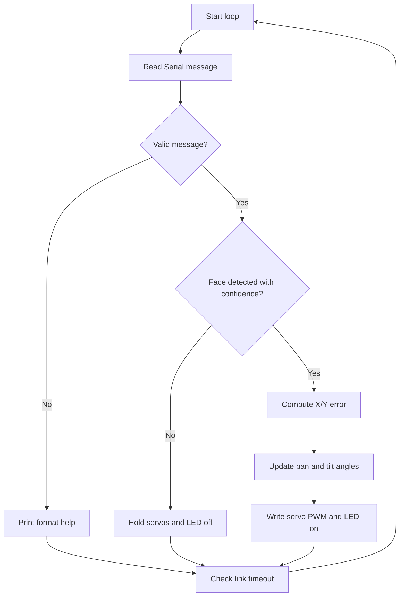

# Implementation Guide - Face Rotation Tracking Camera Firmware

## Algorithm

1. Configure pan and tilt servo PWM channels.
2. Configure the onboard LED as a tracking status output.
3. Wait for Serial messages from the vision side.
4. Parse either `FACE x y confidence` or `NOFACE`.
5. Reject weak detections below the confidence threshold.
6. Calculate face error relative to the image center.
7. Move pan and tilt servos with proportional gains.
8. Turn the status LED on only during active tracking.
9. Mark tracking idle if the vision link times out.

## Flowchart



## Pseudocode

```text
setup servo PWM and status LED
repeat forever:
  read vision serial line
  if line is FACE x y confidence:
    if confidence is high:
      calculate error from frame center
      adjust pan and tilt angles
      turn tracking LED on
    else:
      hold position and turn LED off
  if line is NOFACE:
    hold position and turn LED off
```

## Components List

| Component | Purpose |
|---|---|
| NanoKit Integrated ESP32 | Servo control and status feedback |
| Pan servo | Horizontal camera rotation |
| Tilt servo | Vertical camera rotation |
| External 5 V supply | Servo power |
| Companion computer or SBC | Runs face detection and sends Serial messages |

## Testing

Run `pio run`, upload, and open Serial Monitor. Send `FACE 160 120 0.90`, then `FACE 240 80 0.91`, then `NOFACE`. The status LED should turn on only for valid face tracking messages.

## Troubleshooting

- No movement: verify the Serial message format and newline setting.
- LED stays off: confidence may be below the configured threshold.
- Servo moves backward: invert the gain sign for that axis.
- Servo jitters: improve the external 5 V supply and common ground.

## Learning Notes

The firmware intentionally separates vision from actuator control. This keeps the ESP32 firmware deterministic while allowing the vision algorithm to run on a more powerful computer.

## Exercises

1. Add deadband around the center point.
2. Add Serial commands for gain tuning.
3. Log tracking statistics every second.
4. Add mechanical calibration limits for a real pan/tilt bracket.

## PDF Ready Notes

This document is structured for export and includes the algorithm, flowchart, pseudocode, components, testing, and troubleshooting sections required by the repository specification.
