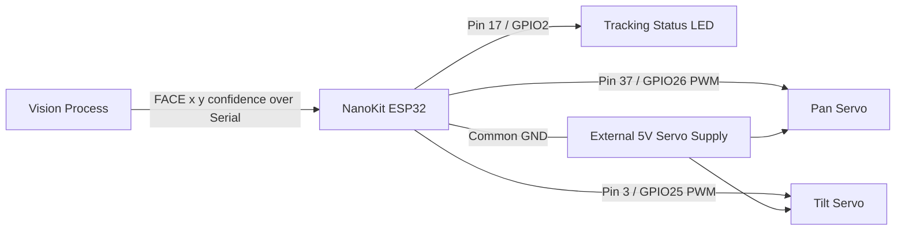

# Connection Diagram - Face Rotation Tracking Camera

```mermaid
flowchart LR
  VISION[Vision Process] -->|FACE x y confidence over Serial| NK[NanoKit ESP32]
  NK -->|Pin 37 / GPIO26 PWM| PAN[Pan Servo]
  NK -->|Pin 3 / GPIO25 PWM| TILT[Tilt Servo]
  NK -->|Pin 17 / GPIO2| LED[Tracking Status LED]
  SUPPLY[External 5V Servo Supply] --> PAN
  SUPPLY --> TILT
  NK ---|Common GND| SUPPLY
```

Render this Mermaid source as PNG/SVG for reports and presentations.
