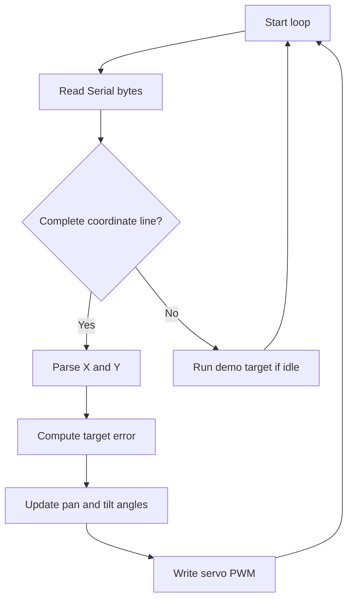

# Implementation Guide - Camera Tracking

## Algorithm

1. Configure two ESP32 LEDC channels for 50 Hz servo PWM.
2. Center pan and tilt servos at boot.
3. Read target coordinates from Serial in the format `X=160 Y=120`.
4. Calculate error between target and frame center.
5. Adjust pan and tilt angles using a small proportional gain.
6. If no Serial input is active, run a safe simulated target path.

## Flowchart



## Pseudocode

```text
setup PWM channels
center servos
repeat forever:
  if serial coordinate received:
    parse x and y
    calculate error from center
    update servo angles gradually
  else:
    move through a slow demo path
```

## Components List

| Component | Purpose |
|---|---|
| NanoKit Integrated ESP32 | Runs tracking control firmware |
| Two hobby servos | Pan and tilt motion |
| External 5 V supply | Servo power |
| Pan/tilt bracket | Mechanical camera mount |

## Testing

Run `pio run`, upload, open Serial Monitor, and send `X=160 Y=120`. Then try `X=220 Y=80` and observe gradual servo movement.

## Troubleshooting

- Servos jitter: use a stronger external 5 V supply and common ground.
- Movement is reversed: invert the gain sign in the axis that moves incorrectly.
- Servo hits a mechanical stop: reduce the angle limits in the source code.

## Learning Notes

The firmware uses proportional control. It does not jump directly to a target angle; it moves based on how far the target is from the center.

## Exercises

1. Add deadband near the center to reduce tiny corrections.
2. Add Serial commands to tune gain.
3. Connect a real computer vision program that streams coordinates.

## PDF Ready Notes

This document contains the algorithm, flowchart, pseudocode, components, tests, and troubleshooting needed for export.
