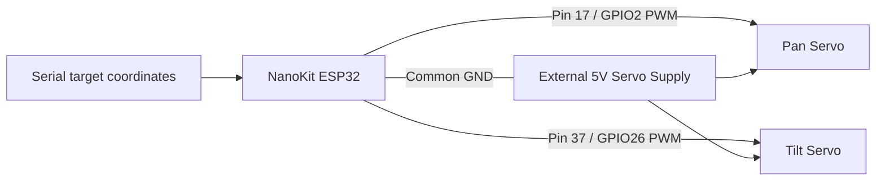

# Connection Diagram - Camera Tracking

```mermaid
flowchart LR
  VISION[Serial target coordinates] --> NK[NanoKit ESP32]
  NK -->|Pin 17 / GPIO2 PWM| PAN[Pan Servo]
  NK -->|Pin 37 / GPIO26 PWM| TILT[Tilt Servo]
  SUPPLY[External 5V Servo Supply] --> PAN
  SUPPLY --> TILT
  NK ---|Common GND| SUPPLY
```

Render this diagram as a report image or use it directly in GitHub documentation.
