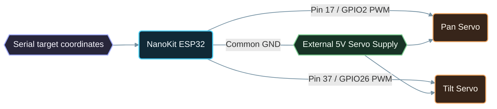

# Connection Diagram - Camera Tracking

**Developed by Amine Saoud ibn al-Bashir.**

```mermaid
flowchart LR
  VISION{{Serial target coordinates}} --> NK("NanoKit ESP32")
  NK -->|Pin 17 / GPIO2 PWM| PAN("Pan Servo")
  NK -->|Pin 37 / GPIO26 PWM| TILT("Tilt Servo")
  SUPPLY{{External 5V Servo Supply}} --> PAN
  SUPPLY --> TILT
  NK ---|Common GND| SUPPLY

  classDef controller fill:#102936,stroke:#4dd4ff,stroke-width:2px,color:#f4fbff
  classDef external fill:#28263a,stroke:#9ea9ff,stroke-width:1.8px,color:#f7f6ff
  classDef actuator fill:#37251a,stroke:#f0a560,stroke-width:1.8px,color:#fff8ef
  classDef power fill:#183326,stroke:#7ccd91,stroke-width:1.8px,color:#f4fff6
  class NK controller
  class VISION external
  class PAN,TILT actuator
  class SUPPLY power
  linkStyle default stroke:#7894a5,stroke-width:1.4px
```

Render this diagram as a report image or use it directly in GitHub documentation.
