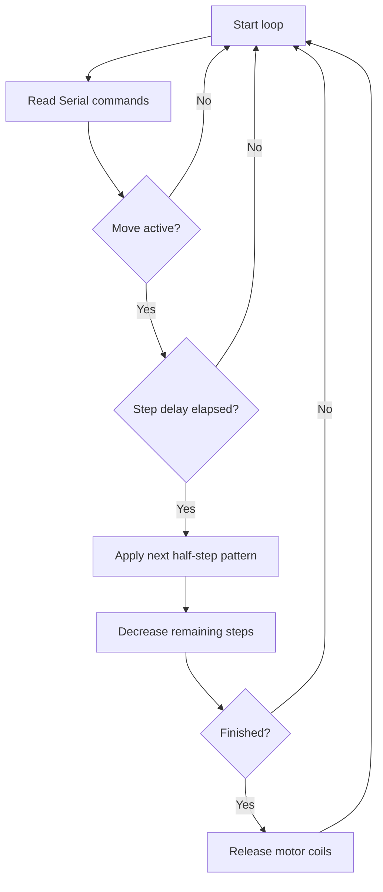

# Implementation Guide - Stepper Motor Control

## Algorithm

1. Configure four GPIO pins as outputs.
2. Store the eight half-step coil patterns in a fixed table.
3. Accept Serial commands for direction, step count, speed, and stop.
4. Use `millis()` timing to step without blocking command input.
5. Release the motor coils when the movement completes.

## Flowchart



## Pseudocode

```text
configure motor pins as outputs
load half-step sequence
repeat forever:
  read serial command
  if steps remain and delay elapsed:
    advance sequence in selected direction
    write coil pattern
    decrease remaining step count
```

## Components List

| Component | Purpose |
|---|---|
| NanoKit Integrated ESP32 | Generates driver control signals |
| ULN2003 driver module | Switches motor coil current safely |
| 28BYJ-48 stepper motor | Demonstrates indexed motion |
| External 5 V supply | Powers the motor driver |

## Testing

Run `pio run`, upload, then open Serial Monitor. Send `CW 2048`, `CCW 2048`, `SPEED 5`, and `STOP` to verify command handling.

## Troubleshooting

- Motor vibrates but does not rotate: IN1-IN4 order may be wrong.
- ESP32 resets: motor supply may be drawing from the board instead of external power.
- Motor gets hot: use `STOP` or let the firmware release coils between moves.

## Learning Notes

Half-stepping alternates single-coil and two-coil states. This improves smoothness compared with a simple four-state full-step sequence.

## Exercises

1. Add acceleration and deceleration ramps.
2. Add buttons for direction control.
3. Convert step counts to degrees.

## PDF Ready Notes

This document is ready for export because it contains algorithm, flowchart, components, testing, and troubleshooting sections.
