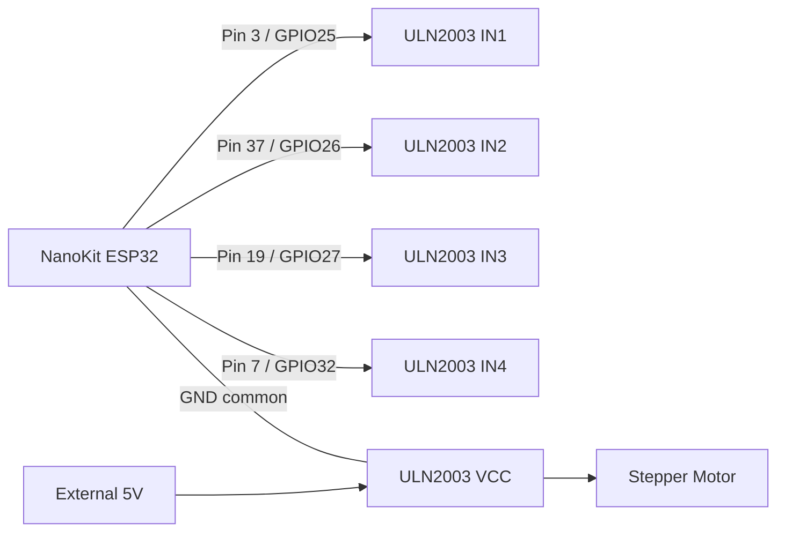

# Connection Diagram - Stepper Motor Control

```mermaid
flowchart LR
  NK[NanoKit ESP32] -->|Pin 3 / GPIO25| IN1[ULN2003 IN1]
  NK -->|Pin 37 / GPIO26| IN2[ULN2003 IN2]
  NK -->|Pin 19 / GPIO27| IN3[ULN2003 IN3]
  NK -->|Pin 7 / GPIO32| IN4[ULN2003 IN4]
  SUPPLY[External 5V] --> DRIVER[ULN2003 VCC]
  NK ---|GND common| DRIVER
  DRIVER --> MOTOR[Stepper Motor]
```

Render this Mermaid diagram to PNG/SVG when preparing reports or tutorial images.
