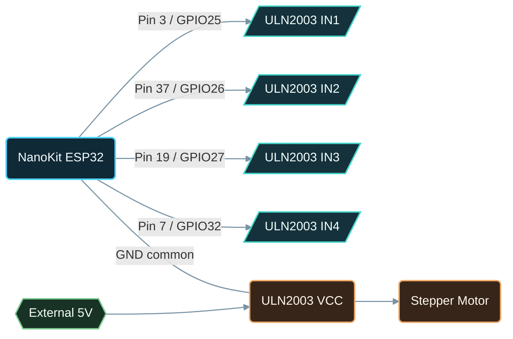

# Connection Diagram - Stepper Motor Control

**Developed by Amine Saoud ibn al-Bashir.**

```mermaid
flowchart LR
  NK("NanoKit ESP32") -->|Pin 3 / GPIO25| IN1[/ULN2003 IN1/]
  NK -->|Pin 37 / GPIO26| IN2[/ULN2003 IN2/]
  NK -->|Pin 19 / GPIO27| IN3[/ULN2003 IN3/]
  NK -->|Pin 7 / GPIO32| IN4[/ULN2003 IN4/]
  SUPPLY{{External 5V}} --> DRIVER("ULN2003 VCC")
  NK ---|GND common| DRIVER
  DRIVER --> MOTOR("Stepper Motor")

  classDef controller fill:#102936,stroke:#4dd4ff,stroke-width:2px,color:#f4fbff
  classDef io fill:#15313c,stroke:#43d5ca,stroke-width:1.8px,color:#f3fffd
  classDef power fill:#183326,stroke:#7ccd91,stroke-width:1.8px,color:#f4fff6
  classDef actuator fill:#37251a,stroke:#f0a560,stroke-width:1.8px,color:#fff8ef
  class NK controller
  class IN1,IN2,IN3,IN4 io
  class SUPPLY power
  class DRIVER,MOTOR actuator
  linkStyle default stroke:#7894a5,stroke-width:1.4px
```

Render this Mermaid diagram to PNG/SVG when preparing reports or tutorial images.
