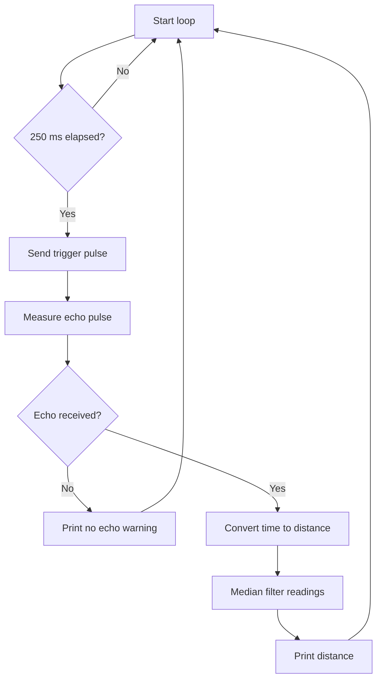

# Implementation Guide - Ultrasonic Distance

## Algorithm

1. Hold TRIG low so the sensor starts idle.
2. Send a 10 microsecond HIGH pulse on GPIO5.
3. Measure the HIGH duration on GPIO34 with a timeout.
4. Convert echo time to distance using the speed of sound.
5. Repeat five times and choose the median value.
6. Print the distance or a troubleshooting message.

## Flowchart



## Pseudocode

```text
configure trigger as output
configure echo as input
repeat forever:
  every 250 ms:
    collect 5 ultrasonic readings
    discard noise by selecting the median
    print distance in centimeters
```

## Components List

| Component | Purpose |
|---|---|
| NanoKit Integrated ESP32 | Runs timing and serial output |
| Ultrasonic sensor | Measures distance by echo time |
| Jumper wires | Connect power and signals |
| Voltage divider or level shifter | Required if ECHO is 5 V |

## Testing

Run `pio run`, upload the firmware, and open the Serial Monitor at 115200 baud. Place a flat object 10-50 cm in front of the sensor and confirm stable readings.

## Troubleshooting

- `No echo detected`: check TRIG/ECHO wiring and sensor power.
- Random high values: add a flat target and reduce acoustic reflections.
- ESP32 resets: sensor wiring or power may be unstable.
- GPIO damage risk: verify ECHO voltage before connecting to GPIO34.

## Learning Notes

The distance calculation divides by two because the sound travels from sensor to object and then back to the sensor.

## Exercises

1. Add minimum and maximum distance warnings.
2. Convert centimeters to inches.
3. Drive the onboard LED when an object is closer than 20 cm.

## PDF Ready Notes

This Markdown file is structured with headings, tables, and diagrams so it can be exported to PDF by GitHub, VS Code extensions, or Pandoc.
