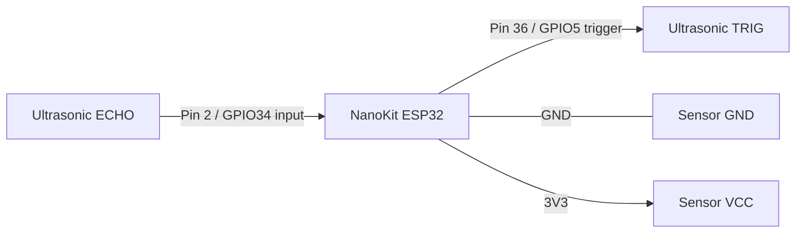

# Connection Diagram - Ultrasonic Distance

```mermaid
flowchart LR
  NK[NanoKit ESP32] -->|Pin 36 / GPIO5 trigger| TRIG[Ultrasonic TRIG]
  ECHO[Ultrasonic ECHO] -->|Pin 2 / GPIO34 input| NK
  NK ---|GND| GND[Sensor GND]
  NK -->|3V3| VCC[Sensor VCC]
```

Use this diagram source as the first professional image asset. It can be rendered to PNG/SVG for reports.
