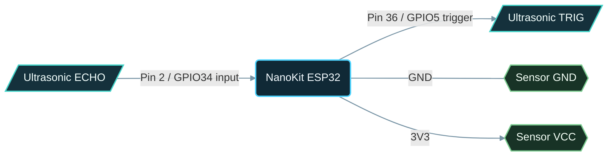

# Connection Diagram - Ultrasonic Distance

**Developed by Amine Saoud ibn al-Bashir.**

```mermaid
flowchart LR
  NK("NanoKit ESP32") -->|Pin 36 / GPIO5 trigger| TRIG[/Ultrasonic TRIG/]
  ECHO[/Ultrasonic ECHO/] -->|Pin 2 / GPIO34 input| NK
  NK ---|GND| GND{{Sensor GND}}
  NK -->|3V3| VCC{{Sensor VCC}}

  classDef controller fill:#102936,stroke:#4dd4ff,stroke-width:2px,color:#f4fbff
  classDef io fill:#15313c,stroke:#43d5ca,stroke-width:1.8px,color:#f3fffd
  classDef power fill:#183326,stroke:#7ccd91,stroke-width:1.8px,color:#f4fff6
  class NK controller
  class TRIG,ECHO io
  class GND,VCC power
  linkStyle default stroke:#7894a5,stroke-width:1.4px
```

Use this diagram source as the first professional image asset. It can be rendered to PNG/SVG for reports.
