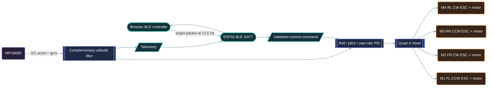
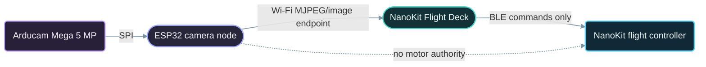

# Architecture - NanoKit Drone 4X (Quadcopter)

**Developed by Amine Saoud ibn al-Bashir.**

## Design Intent

This project is a small, manually controlled Quad-X reference platform. Its physical form follows a compact four-arm drone: a centered flight controller and IMU, four brushless power units, an optional isolated front camera, and BLE control from a browser application. The first milestone is a safe restrained bench system, not autonomous flight.

## Control Chain

## Firmware Responsibilities

| Stage | Responsibility | Safety behaviour |
|---|---|---|
| PWM boot | Configure four ESC outputs at 1000 us. | Motors receive minimum throttle before sensor or BLE startup. |
| IMU | Wake MPU6050, read accel/gyro, and calculate level offsets. | A missing read or invalid calibration disarms immediately. |
| Estimator | Combine gyro integration with accelerometer roll/pitch. | Yaw stays relative because MPU6050 has no magnetometer. |
| BLE | Receive compact commands and publish telemetry. | BLE disconnect disarms and advertising restarts. |
| PID | Convert target minus measured attitude into corrections. | Integrals are clamped and reset on every disarm. |
| Mixer | Apply corrections to the four ESC pulses. | Each pulse is constrained to the defined idle and maximum limits. |
| Failsafe | Watch the command age. | A stale command after 700 ms stops all motors. |

## Required Separation

- The LiPo powers the ESCs directly through a correctly rated distribution path.
- A regulated 5 V BEC powers NanoKit and low-power equipment; do not use NanoKit 3.3 V for motors, ESCs, or camera equipment.
- The MPU6050 is a 3.3 V logic device connected by I2C.
- All signal systems share a common ground with the ESC/BEC power system.
- The optional camera must remain electrically isolated from the flight control loop. It is not a source of arm, throttle, or stabilisation commands.

## Camera Node Boundary

The Arducam Mega 5 MP camera is treated as a separate ESP32 Wi-Fi node. Its SPI bus follows the documented ESP32 mapping, while its image endpoint is rendered in the Flight Deck's camera viewport. This avoids adding camera transport, Wi-Fi streaming, and large buffers to the NanoKit flight controller, which is already close to its usable flash capacity with BLE safety firmware.

## Open-Source Boundary

The implementation is original educational reference code. It uses published engineering patterns from established open-source flight stacks, without copying their source. See [Open_Source_References](Open_Source_References.md) for the specific projects and the concepts studied.
