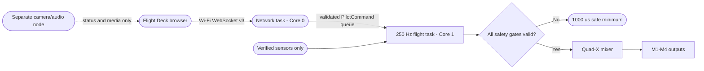

# Architecture - NanoKit Drone 4X

**Developed by Amine Saoud ibn al-Bashir.**

## Design Intent

The project is split into three isolated systems so network and payload work cannot block the deterministic flight loop.

```mermaid
flowchart LR
  Deck(["Flight Deck browser"]) -->|"Wi-Fi WebSocket v3"| Link(["Network task - Core 0"])
  Link -->|"validated PilotCommand queue"| Flight["250 Hz flight task - Core 1"]
  Sensors(["Verified sensors only"]) --> Flight
  Flight --> Safety{"All safety gates valid?"}
  Safety -->|"No"| Safe(["1000 us safe minimum"])
  Safety -->|"Yes"| Mixer["Quad-X mixer"]
  Mixer --> Esc["M1-M4 outputs"]
  Camera(["Separate camera/audio node"]) -. "status and media only" .-> Deck
```

## Flight Controller Modules

| Module | Responsibility |
|---|---|
| `core/` | Shared state, telemetry structures, and safety state machine. |
| `control/` | PID primitives, flight controller, and Quad-X motor mixer. |
| `sensors/` | Sensor health and future real measurement drivers. |
| `network/` | SoftAP, HTTP/LittleFS server, WebSocket command parser, telemetry broadcast. |
| `navigation/` | Mode gates; advanced modes remain disabled without verified sensors. |
| `storage/` | Future persistent configuration behind a feature flag. |

FreeRTOS queues transfer complete snapshots between tasks. The network task cannot call the mixer or write motor outputs. The camera node has no path to the command queue.

## Timing

- Flight task: 250 Hz, Core 1, priority 4.
- Network task: Core 0, priority 1.
- Browser command cadence: 10 Hz.
- Command timeout: 600 ms.
- Telemetry cadence: 10 Hz.

## Truthful Telemetry

Each optional measurement has an explicit validity field. The interface renders a value only when the matching field is true. Disabled or absent hardware is reported as unavailable; the firmware does not generate demonstration values.

## Expansion Rule

A new driver is added behind its feature flag, with its pin map and electrical constraints documented first. The flag stays `0` until a propeller-free hardware test verifies initialization, continuous reads, disconnect behaviour, and safety interaction.
