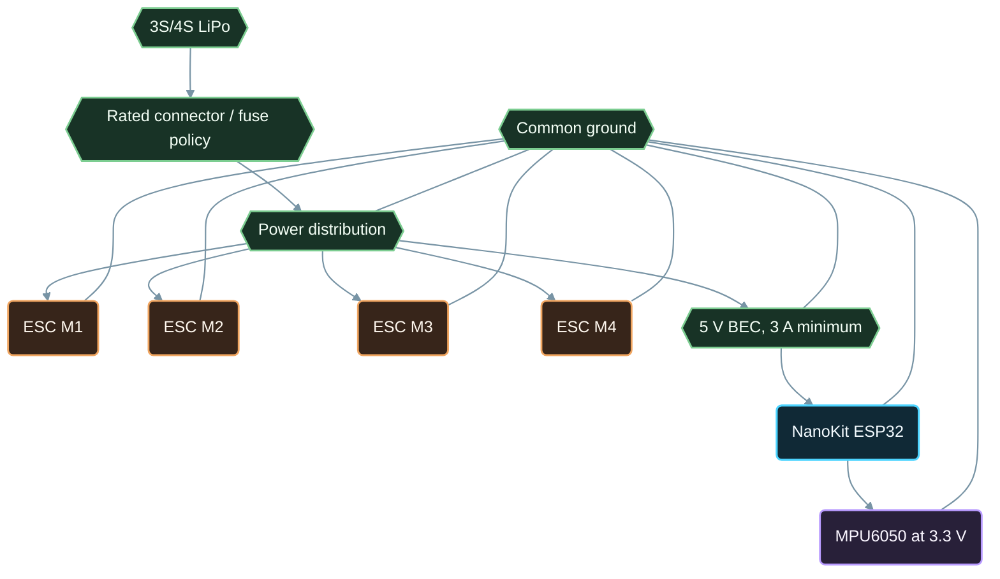

# Wiring - NanoKit Drone 4X (Quadcopter)

**Developed by Amine Saoud ibn al-Bashir.**

## Flight-Control Signals

| NanoKit pin | ESP32 GPIO | Connect to | Direction | Electrical note |
|---:|---|---|---|---|
| 23 | GPIO21 | MPU6050 SDA | I2C data | 3.3 V logic only. |
| 18 | GPIO22 | MPU6050 SCL | I2C clock | 3.3 V logic only. |
| 3 | GPIO25 | M1 front-left ESC signal | Output | 50 Hz, 1000-1900 us pulse. |
| 37 | GPIO26 | M2 front-right ESC signal | Output | 50 Hz, 1000-1900 us pulse. |
| 19 | GPIO27 | M3 rear-right ESC signal | Output | 50 Hz, 1000-1900 us pulse. |
| 7 | GPIO32 | M4 rear-left ESC signal | Output | 50 Hz, 1000-1900 us pulse. |
| 12 or 31 | GND | IMU, BEC, and ESC signal ground | Reference | All signal grounds must be common. |
| 13 or 14 | 3V3 | MPU6050 VCC | Power | Only for a 3.3 V compatible MPU6050 module. |

## Recommended Power Topology

## Build Order

1. Remove every propeller and disconnect the LiPo.
2. Mount the MPU6050 rigidly and align its board axes with the frame axes. Record any rotation before changing code.
3. Connect IMU power, ground, SDA, and SCL. Confirm the serial monitor reports `MPU6050: OK`.
4. Connect the four ESC signal wires and one shared ESC/BEC ground wire to the NanoKit ground.
5. Power NanoKit from USB first and verify all four outputs start at 1000 us.
6. Connect the LiPo only after a current-safe bench setup is ready. Use a smoke stopper for the first power-up.
7. Check one motor at a time, with props removed, against the motor order in [Motor Layout](../images/motor-layout.md).
8. Install propellers only after the complete checklist in [Testing](Testing.md) passes.

## ESC And Motor Notes

The reference firmware sends 1000 us when disarmed, begins at 1060 us only after safe arming, and limits command output to 1900 us. ESC endpoint calibration differs by manufacturer. Follow the ESC manufacturer's prop-off calibration procedure; do not improvise a high-throttle calibration routine inside the flight firmware.

Choose motors, props, ESCs, wire gauge, battery connector, and LiPo C rating as one electrical system. Measure actual current with the final propeller and battery combination, then retain at least a 20-30% current margin in the ESC and wiring selection.

## Optional Arducam Mega 5 MP Camera Node

Connect the Arducam Mega camera to a **separate ESP32 Wi-Fi camera node**, not to the NanoKit flight controller used by this project. The camera uses the normal ESP32 VSPI mapping shown below; the matching NanoKit pin numbers are documented so a second NanoKit can be used as that camera node.

| Camera pin | ESP32 GPIO | NanoKit pin | Note |
|---|---:|---:|---|
| VCC | 3.3 V | 13 or 14 | Do not apply 5 V logic to the SPI camera. |
| GND | GND | 12 or 31 | Common ground within the camera node only. |
| SCK | GPIO18 | 38 | VSPI clock. |
| MISO | GPIO19 | 16 | VSPI MISO. |
| MOSI | GPIO23 | 24 | VSPI MOSI. |
| CS | GPIO17 | 39 | Dedicated camera chip select. |

The camera node must be powered from a clean regulated rail. Do not let a camera reset, Wi-Fi reconnect, or image transfer share the NanoKit flight-control timing path. See [Camera Integration](Camera_Integration.md).
