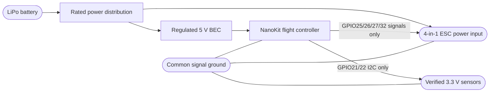

# Wiring - NanoKit Drone 4X

**Developed by Amine Saoud ibn al-Bashir.**

## Confirmed Signal Map

| Function | ESP32 GPIO | Direction | Status |
|---|---|---|---|
| I2C SDA | GPIO21 | Bidirectional | Confirmed bus pin |
| I2C SCL | GPIO22 | Output clock | Confirmed bus pin |
| M1 signal | GPIO25 | Output | Confirmed signal pin; ESC protocol not confirmed |
| M2 signal | GPIO26 | Output | Confirmed signal pin; ESC protocol not confirmed |
| M3 signal | GPIO27 | Output | Confirmed signal pin; ESC protocol not confirmed |
| M4 signal | GPIO32 | Output | Confirmed signal pin; ESC protocol not confirmed |

The exact ICM-20948 module wiring is still TODO. Do not infer its supply, address strap, interrupt, or auxiliary pins from the confirmed I2C bus alone.

## Power Boundary

```mermaid
flowchart LR
  LiPo(["LiPo battery"]) --> PDB["Rated power distribution"]
  PDB --> ESC(["4-in-1 ESC power input"])
  PDB --> BEC["Regulated 5 V BEC"]
  BEC --> NanoKit["NanoKit flight controller"]
  NanoKit -->|"GPIO25/26/27/32 signals only"| ESC
  NanoKit -->|"GPIO21/22 I2C only"| Bus(["Verified 3.3 V sensors"])
  GND(["Common signal ground"]) --- NanoKit
  GND --- ESC
  GND --- Bus
```

Motor current never passes through NanoKit. Select the BEC, wire gauge, connectors, capacitor, ESC, battery, motors, and propellers as one measured power system.

## Unassigned Interfaces

ICM-20948, GNSS, PMW3901, HC-SR04, status LED, buzzer, camera, microphone, speaker, microSD, servo, BME280, DPS310, INA226, AT24C256, TCA9548A, and VL53L1CX pins are intentionally absent. They remain TODO until verified.

## Electrical Notes

- Confirm that the exact 4-in-1 ESC accepts 1000-2000 us analogue PWM before changing the firmware gate.
- Level-shift HC-SR04 ECHO when the module outputs 5 V.
- Verify BME280 and DPS310 addresses or isolate them through TCA9548A.
- Put each of six VL53L1CX sensors on its own TCA9548A channel.
- Power servos and high-current payloads from a suitable regulated rail, never from an ESP32 GPIO.
- Keep a common ground between all signal systems.
