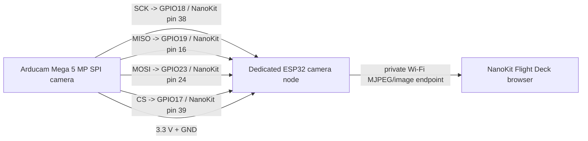

# Camera Wiring - Arducam Mega 5 MP Camera Node

**Developed by Amine Saoud ibn al-Bashir.**

This is a separate camera node. It does not connect to NanoKit motor pins, MPU6050 I2C, PID calculations, or BLE flight-command handling.
