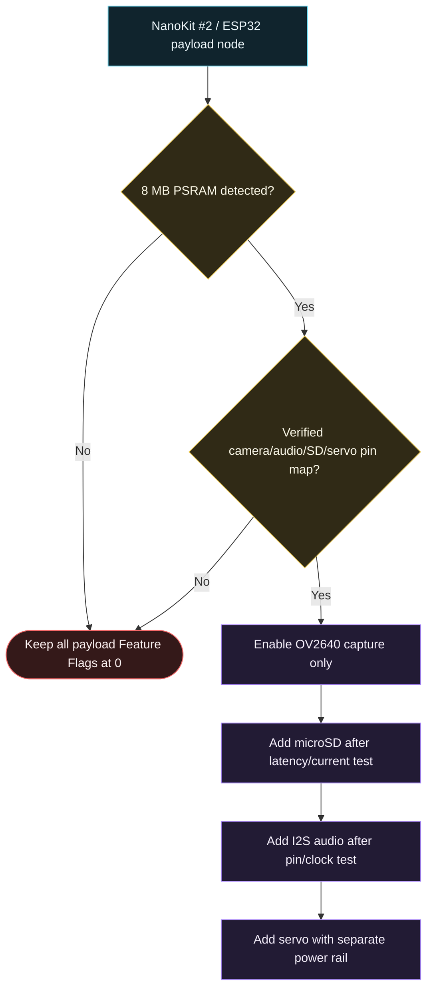

# Camera and Audio Node Wiring Gate

**Developed by Amine Saoud ibn al-Bashir.**

```mermaid
flowchart TD
  Board["NanoKit #2 / ESP32 payload node"]
  PSRAM{"8 MB PSRAM detected?"}
  Pins{"Verified camera/audio/SD/servo pin map?"}
  Locked(["Keep all payload Feature Flags at 0"])
  Stage1["Enable OV2640 capture only"]
  Stage2["Add microSD after latency/current test"]
  Stage3["Add I2S audio after pin/clock test"]
  Stage4["Add servo with separate power rail"]

  Board --> PSRAM
  PSRAM -->|"No"| Locked
  PSRAM -->|"Yes"| Pins
  Pins -->|"No"| Locked
  Pins -->|"Yes"| Stage1 --> Stage2 --> Stage3 --> Stage4

  classDef controller fill:#10242d,stroke:#67d5ee,color:#eefaff
  classDef condition fill:#302a16,stroke:#e7c653,color:#fffbe8
  classDef safety fill:#341919,stroke:#ee6666,color:#fff1f1
  classDef payload fill:#221b34,stroke:#ad8cff,color:#f7f0ff
  class Board controller
  class PSRAM,Pins condition
  class Locked safety
  class Stage1,Stage2,Stage3,Stage4 payload
```

No physical payload pin is assigned yet. This prevents a reference ESP32 camera pin map from being mistaken for confirmed NanoKit wiring.
