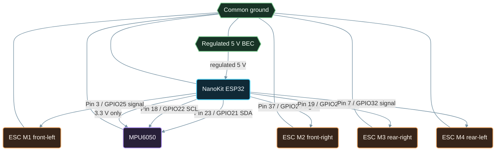

# Connection Diagram - NanoKit Drone 4X (Quadcopter)

**Developed by Amine Saoud ibn al-Bashir.**

ESC power leads go directly to the LiPo power-distribution path, not through NanoKit. Connect at least one ESC/BEC ground to NanoKit ground so PWM signals have a shared electrical reference.

The Arducam Mega camera wiring is intentionally documented separately in [camera-wiring.md](camera-wiring.md), because it belongs to the independent camera node rather than the flight controller.
