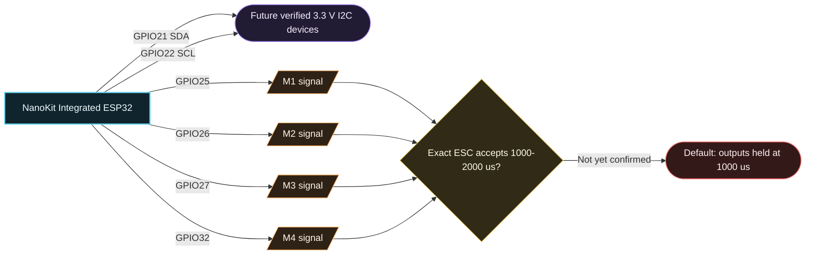

# Confirmed Connection Diagram - NanoKit Drone 4X

**Developed by Amine Saoud ibn al-Bashir.**

```mermaid
flowchart LR
  NK["NanoKit Integrated ESP32"]
  Bus(["Future verified 3.3 V I2C devices"])
  M1[/"M1 signal"/]
  M2[/"M2 signal"/]
  M3[/"M3 signal"/]
  M4[/"M4 signal"/]
  Gate{"Exact ESC accepts 1000-2000 us?"}
  Safe(["Default: outputs held at 1000 us"])

  NK -->|"GPIO21 SDA"| Bus
  NK -->|"GPIO22 SCL"| Bus
  NK -->|"GPIO25"| M1
  NK -->|"GPIO26"| M2
  NK -->|"GPIO27"| M3
  NK -->|"GPIO32"| M4
  M1 --> Gate
  M2 --> Gate
  M3 --> Gate
  M4 --> Gate
  Gate -->|"Not yet confirmed"| Safe

  classDef controller fill:#10242d,stroke:#67d5ee,color:#eefaff,stroke-width:2px
  classDef bus fill:#221b34,stroke:#ad8cff,color:#f7f0ff
  classDef actuator fill:#2e2116,stroke:#f0a24a,color:#fff6eb
  classDef condition fill:#302a16,stroke:#e7c653,color:#fffbe8
  classDef safety fill:#341919,stroke:#ee6666,color:#fff1f1
  class NK controller
  class Bus bus
  class M1,M2,M3,M4 actuator
  class Gate condition
  class Safe safety
```

No camera, audio, SD, servo, GNSS, optical-flow, ultrasonic, LED, buzzer, or sensor-specific pin is confirmed by this diagram.
