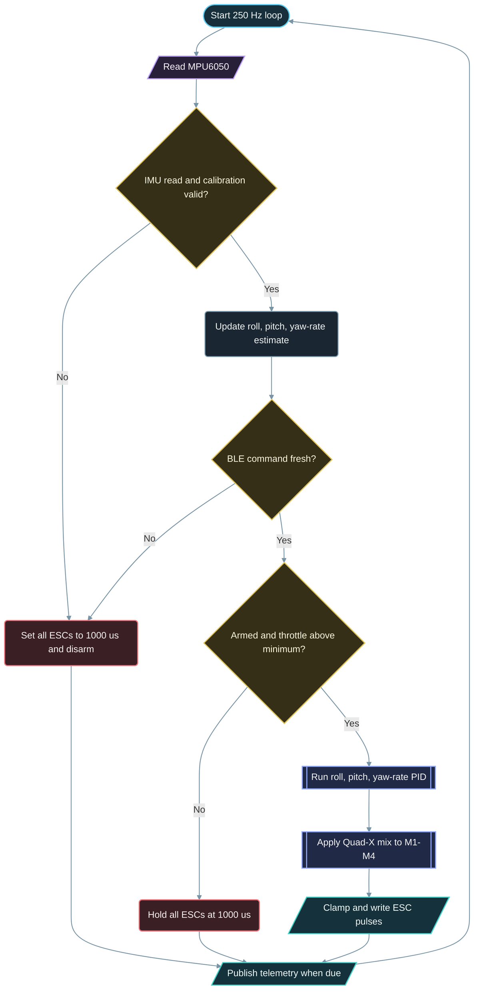

# Control Loop - NanoKit Drone 4X (Quadcopter)

**Developed by Amine Saoud ibn al-Bashir.**

The loop is intentionally simple. The failsafe branches occur before the mixer so no stale command can continue driving a motor output.
