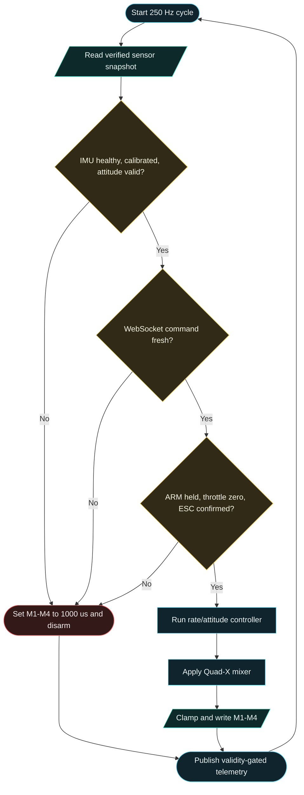

# Control Loop - NanoKit Drone 4X

**Developed by Amine Saoud ibn al-Bashir.**

```mermaid
flowchart TD
  Start(["Start 250 Hz cycle"])
  Read[/"Read verified sensor snapshot"/]
  Sensor{"IMU healthy, calibrated, attitude valid?"}
  Link{"WebSocket command fresh?"}
  Arm{"ARM held, throttle zero, ESC confirmed?"}
  Control["Run rate/attitude controller"]
  Mix["Apply Quad-X mixer"]
  Output[/"Clamp and write M1-M4"/]
  Safe(["Set M1-M4 to 1000 us and disarm"])
  Telemetry(["Publish validity-gated telemetry"])

  Start --> Read --> Sensor
  Sensor -->|"No"| Safe
  Sensor -->|"Yes"| Link
  Link -->|"No"| Safe
  Link -->|"Yes"| Arm
  Arm -->|"No"| Safe
  Arm -->|"Yes"| Control --> Mix --> Output --> Telemetry
  Safe --> Telemetry
  Telemetry --> Start

  classDef process fill:#10242d,stroke:#67d5ee,color:#eefaff
  classDef input fill:#0d2929,stroke:#4ed6c4,color:#edfffc
  classDef condition fill:#302a16,stroke:#e7c653,color:#fffbe8
  classDef safety fill:#341919,stroke:#ee6666,color:#fff1f1
  class Start,Telemetry process
  class Read,Output input
  class Sensor,Link,Arm condition
  class Safe safety
  class Control,Mix process
```

With repository defaults, sensor and ESC confirmation gates are false; the loop publishes the locked state and keeps every output at minimum.
