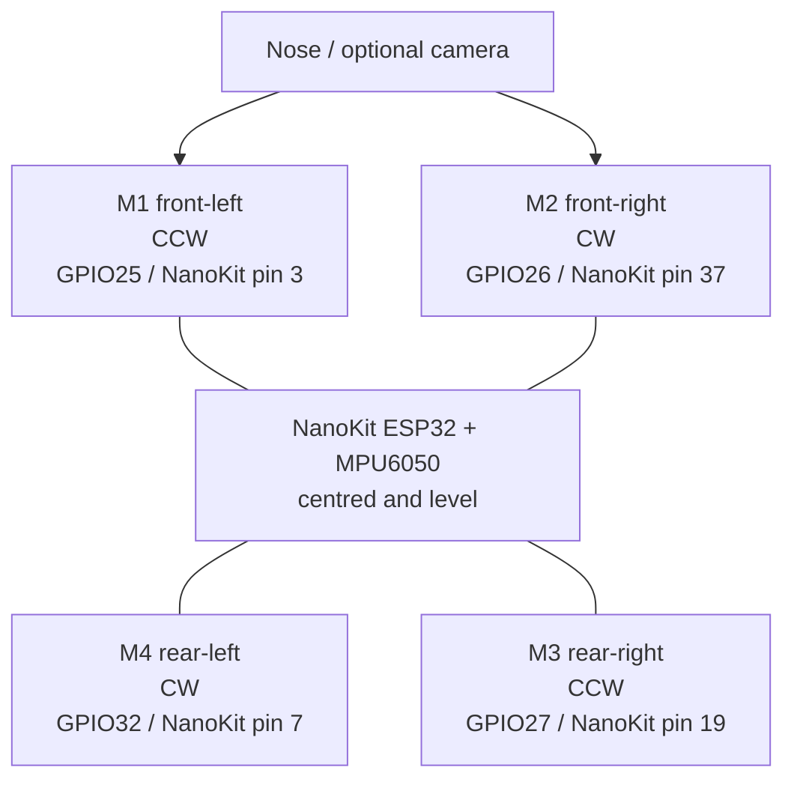

# Motor Layout - NanoKit Drone 4X (Quadcopter)

**Developed by Amine Saoud ibn al-Bashir.**

View from above. The nose, camera, and forward flight direction are at the top of the diagram.

| Motor | Position | Rotation | Propeller type |
|---|---|---|---|
| M1 | Front left | CCW | CCW propeller |
| M2 | Front right | CW | CW propeller |
| M3 | Rear right | CCW | CCW propeller |
| M4 | Rear left | CW | CW propeller |

The firmware mixer and this table are coupled. If the physical frame changes motor numbering, update the documentation and code together, then repeat all prop-off validation.
