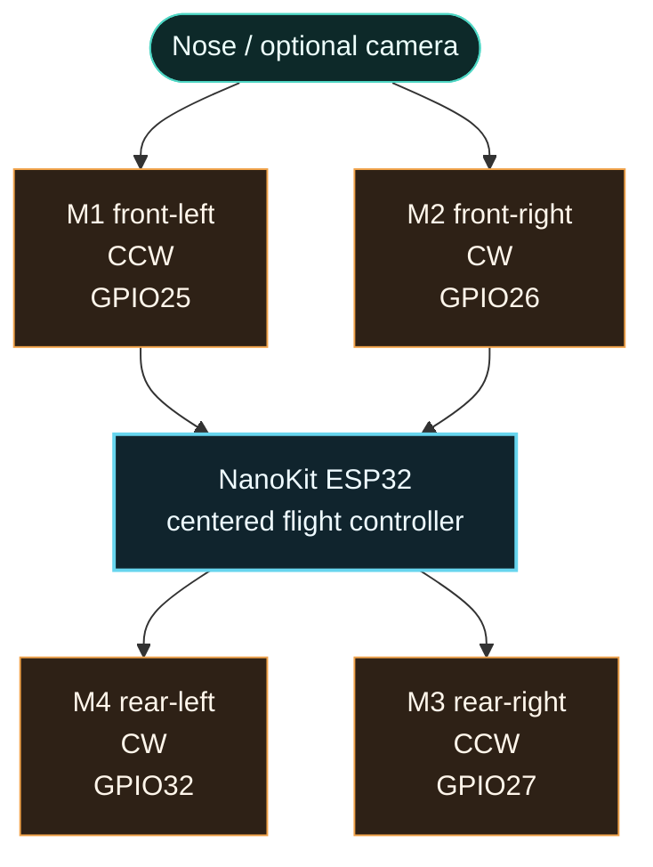

# Motor Layout - NanoKit Drone 4X

**Developed by Amine Saoud ibn al-Bashir.**

View from above. The nose and optional camera point toward the top.

```mermaid
flowchart TD
  Nose(["Nose / optional camera"])
  M1["M1 front-left\nCCW\nGPIO25"]
  M2["M2 front-right\nCW\nGPIO26"]
  FC["NanoKit ESP32\ncentered flight controller"]
  M4["M4 rear-left\nCW\nGPIO32"]
  M3["M3 rear-right\nCCW\nGPIO27"]

  Nose --> M1
  Nose --> M2
  M1 --> FC
  M2 --> FC
  FC --> M4
  FC --> M3

  classDef controller fill:#10242d,stroke:#67d5ee,color:#eefaff,stroke-width:2px
  classDef actuator fill:#2e2116,stroke:#f0a24a,color:#fff6eb
  classDef reference fill:#0d2929,stroke:#4ed6c4,color:#edfffc
  class FC controller
  class M1,M2,M3,M4 actuator
  class Nose reference
```

| Motor | Position | Rotation | Signal GPIO |
|---|---|---|---|
| M1 | Front left | CCW | GPIO25 |
| M2 | Front right | CW | GPIO26 |
| M3 | Rear right | CCW | GPIO27 |
| M4 | Rear left | CW | GPIO32 |

The motor pins are confirmed, but the exact ESC analogue PWM protocol is not. Keep propellers removed and the compile-time confirmation gate at `0` until bench verification is documented.
