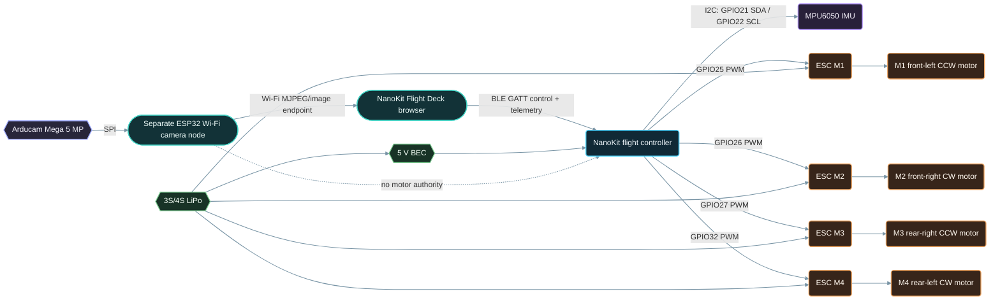

# System Diagram - NanoKit Drone 4X (Quadcopter)

**Developed by Amine Saoud ibn al-Bashir.**

The optional front camera is a separate Wi-Fi observation node. It cannot bypass NanoKit, control motors, or share the flight-control timing path.
