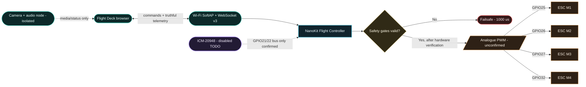

# System Diagram - NanoKit Drone 4X

**Developed by Amine Saoud ibn al-Bashir.**

```mermaid
flowchart LR
  Deck(["Flight Deck browser"])
  Link(["Wi-Fi SoftAP + WebSocket v3"])
  FC["NanoKit Flight Controller"]
  IMU(["ICM-20948 - disabled TODO"])
  Gate{"Safety gates valid?"}
  Safe(["Failsafe - 1000 us"])
  PWM[/"Analogue PWM - unconfirmed"/]
  ESC1["ESC M1"]
  ESC2["ESC M2"]
  ESC3["ESC M3"]
  ESC4["ESC M4"]
  Payload(["Camera + audio node - isolated"])

  Deck <-->|"commands + truthful telemetry"| Link
  Link --> FC
  IMU -. "GPIO21/22 bus only confirmed" .-> FC
  FC --> Gate
  Gate -->|"No"| Safe
  Gate -->|"Yes, after hardware verification"| PWM
  PWM -->|"GPIO25"| ESC1
  PWM -->|"GPIO26"| ESC2
  PWM -->|"GPIO27"| ESC3
  PWM -->|"GPIO32"| ESC4
  Payload -. "media/status only" .-> Deck

  classDef controller fill:#10242d,stroke:#67d5ee,color:#eefaff,stroke-width:2px
  classDef sensor fill:#221b34,stroke:#ad8cff,color:#f7f0ff
  classDef communication fill:#0d2929,stroke:#4ed6c4,color:#edfffc
  classDef actuator fill:#2e2116,stroke:#f0a24a,color:#fff6eb
  classDef safety fill:#341919,stroke:#ee6666,color:#fff1f1
  classDef condition fill:#302a16,stroke:#e7c653,color:#fffbe8
  class FC controller
  class IMU sensor
  class Deck,Link,Payload communication
  class PWM,ESC1,ESC2,ESC3,ESC4 actuator
  class Safe safety
  class Gate condition
```

The camera/audio node has no route to motor authority. The default ESC confirmation gate is false, so the only reachable motor result is the safe minimum.
